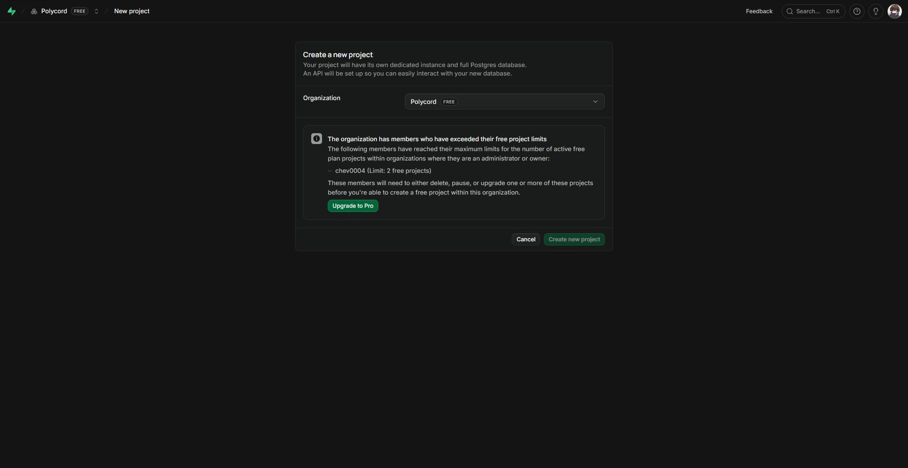

# TEST-005: isolated database burst experiment

## Result

**Blocked before testing: no separate free Supabase project is available.** Neither driver has a pass or fail result from this experiment. There is no evidence supporting a driver change or rollout.

Checked on October 4, 2026 (America/Chicago), October 5 at 04:14 UTC. The experiment branch is `test/test-005`, based on merged SAFETY-005 commit `b23fcd64d829be7271f45cdae74c15f8c3dace2f` ([PR #257](https://github.com/chev0004/Polycord/pull/257)). No experiment commit was deployed.

## Isolation check

The authenticated [Supabase project creation page for the Polycord organization](https://supabase.com/dashboard/new/ecchcnwbuzghirybgpvq) disabled project creation and identified `chev0004` as having reached the limit of two active free projects. The dashboard requires an existing project to be paused, deleted or upgraded before another free project can be created.

[Supabase's billing documentation](https://supabase.com/docs/guides/platform/billing-on-supabase#free-plan) confirms that this limit applies across organizations where the account is an owner or administrator. Creating another organization would not provide an additional free slot. Paused projects do not count toward the limit.

TEST-005 requires a separate disposable database and explicitly permits reporting this limitation when separate free hosted isolation is unavailable. A branch, schema or throwaway Netlify site using the existing database would not satisfy that requirement.

No existing project was paused, deleted or upgraded. No test project or Netlify site was created. No database connection, migration, seed, probe, load request or hosted fault injection was performed. No staging or production environment variables, pooler settings, schemas or data were changed. There is no temporary infrastructure or synthetic data to remove.

## Measurements

| Required evidence | Result |
| --- | --- |
| Disposable endpoint distinct from staging and production | Unavailable; isolation gate did not pass |
| Deployed experiment commit and Netlify site | None |
| Existing driver sequential and mixed-query probes | Not run |
| `pg` sequential and mixed-query probes | Not run; candidate not installed or wired |
| 12 parallel queries and three 60-request bursts per driver | Not run |
| Response counts, errors and latency | No samples |
| Database limits and observed connection usage | Not measured |
| Ban enforcement, internal authentication and trusted IP behavior | Not exercised by this experiment |
| Unreachable database, stalled BEGIN/query and recovery | Not exercised by this experiment |

The earlier 15-connection session-pool limit, 60-request failures and transaction-pool hangs recorded in the ticket remain prior observations. This experiment did not reproduce them or establish their cause.

## Baseline for a later run

The merged baseline uses Postgres.js `3.4.9` with prepared statements disabled. The shared application client allows five connections per instance; each ban lookup creates a separate client limited to one connection and closes it after the lookup. Connection establishment is bounded at three seconds, idle connections expire after 20 seconds, ban statements have a 2,500 ms transaction-local timeout, and the internal ban-check route has a 3,000 ms overall deadline with a no-store 503 on failure.

These are source configuration values, not measured capacity or latency. The candidate proposed in TEST-005 is `pg` with transaction pooling, an initial per-instance pool of one and bounded connection, queue and query waits. It remains untested.

## Recommendation

Keep the merged SAFETY-005 implementation. Reopen the experiment when a separate free project slot is available. Choosing an existing project to pause or delete requires a separate decision about that project's availability and data; this experiment did not make that decision.

For a later run:

1. Create a disposable Supabase project and verify its project reference and database endpoint differ from every staging and production endpoint before connecting. Give all build, migration and runtime jobs only disposable credentials.
2. Run the existing driver and `pg` under identical sequential, mixed-query and transaction workloads. Include 12 parallel queries and at least three 60-request bursts for each driver. Record driver versions, pool settings, database limits, latency, outcomes and connection usage; document any difference from the previously reported 15-connection constraint.
3. Only after the standalone probes pass, use the supported Drizzle adapter on the experiment branch and a throwaway Netlify site. Exercise allowed pages and APIs, account and remembered-identity bans, IP bans, internal authentication and trusted IP handling.
4. Verify bounded no-store 503s and connection cleanup for unreachable database, stalled transaction start and stalled query cases. Confirm later requests recover without an application restart.
5. Preserve the measurements and deployed commit, give the candidate a pass or fail verdict, then remove the disposable site, database and synthetic data. Any live implementation or rollout needs separate follow-up work.

Changing the pooler port alone is not evidence of increased capacity. A local result alone would not establish behavior under Netlify concurrency.

## Report validation

`bun run check:all` passed, including Biome, the UI string check and TypeScript. Biome reported existing warnings in unrelated integration fixtures. This validates the repository checks only; it provides no database burst evidence.

The report commit and PR title carry `[skip netlify]` to prevent branch and preview builds from running the repository's database migration check against an existing site's credentials. Retain that marker while reviewing this report. [Netlify documents the commit and PR-title controls separately](https://docs.netlify.com/deploy/manage-deploys/manage-deploys-overview/).
