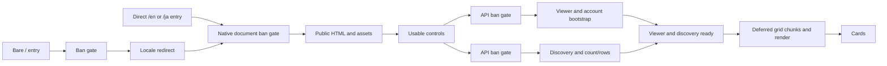

# DISC-031 discovery startup diagnosis

Discovery has two substantial startup costs: the HTTPS ban gate can delay the first document while the application function initializes, and the first data request still pays framework and database-driver costs after the shell is usable. Ordinary warmed visits are much faster. Runtime replacement after idle can bring these costs back without a new deployment.

Three fresh anonymous `/en` single visits per comparison produced usable-shell / rendered-card p50 values of **6.164 / 7.411 seconds with HTTPS**, **1.932 / 6.759 seconds with direct lookup**, **1.306 / 4.589 seconds with fixed synthetic data**, and **1.910 / 6.563 seconds with only a database connection and `select 1`**. The connection control closely reproduces real data latency. Removing ranking SQL alone therefore does not remove most of the first data wait.

The same discovery payload returned through the application package takes **3.118–4.298 seconds** on first HTTP requests. A small authenticated function returning that payload takes **1.395–1.915 seconds**. This bounds a substantial framework/package contribution independently of ranking SQL. Its measured invocation includes about 1.6–1.9 seconds outside the API route body; the small import at the wrapper boundary takes about 0.17–0.21 seconds. The remaining external gap is recorded separately and cannot be assigned to a particular provider internal.

## Serving configuration and resources

The read-only staging inspection found `polycord-staging`, site `694f7324-d2b5-43b5-9de4-ae33e0b927ee`, serving `ea3c39430f80c39d84e0fc8a545704e1f90b8657` from `develop`, deployment `6ac5d12e5051fa000885813c`, in **production context**. `POLYCORD_DIRECT_BAN_CHECK` had no configured value, selecting HTTPS. Staging automatic builds remained enabled. Site naming does not determine the serving context.

All uploads, fixtures and load/fault tests used the exclusive Netlify `polycord-disc027-supabase` sandbox, ID `0c36e849-7617-4665-a657-1eb2b60da3d2`, and Supabase `vioatoyjsfzqrpohliaa`. Functions and database are in Ohio, `us-east-2` / Netlify `cmh`. The database is free Nano, `t3a.nano`, PostgreSQL **17.11**. The fixture has **5,000 profiles, zero real profiles, 4,735 discoverable**. The final fixture check reconfirms these counts. Application traffic uses transaction pooler `aws-0-us-east-2.pooler.supabase.com:6543`; fixture and recovery verification use its session port `5432`.

Both function packages have **1,024 MB** in the provider metadata. Local packaging/runner Node is **22.23.3**, observed hosted Node **22.23.2**, Next **15.5.25**, pg **8.23.1**, postgres-js **3.4.9**, adapter **5.16.2**, CLI **27.11.0**, local Netlify Build **37.4.0**, Playwright **1.63.0**, Bun **1.3.14**, Chrome **154.0.8037.98**. The runner is the user's Windows machine. America/Chicago is its configured timezone; physical location and provider edge location were not independently verified.

The source is `ea3c39430f80c39d84e0fc8a545704e1f90b8657` plus the preserved [instrumentation patch](../../../experiments/discovery-trace/instrumentation.patch). A wrapper around the prepared function records its earliest observable module entry, dynamic framework import, invocation and real module-instance UUID. Native edge and API probes record real module UUIDs independently. These are module instances, not counts of physical VMs. All **351 deployment pairs** have distinct published main-package digests and **zero overlapping captured identifiers** in [independence.json](independence.json).

Each [deployment record](raw/) includes the source, instrumentation SHA-256, prepared/published matching function digest, verified `nodejs22.x` runtime, function digests, edge hashes, region, immutable origin and null build-job ID. Automatic sandbox builds stayed stopped. Candidates were packaged locally, then reused for stamped no-build uploads. The local Windows adapter file-URL correction and Linux ffprobe tracing override were packaging-only; ordinary source configuration is restored. The small control was bundled separately because NFT did not include its extensionless TypeScript dependency. It returns the same serialized discovery payload as the fixed framework control.

## Workload and measurement boundaries

The previous three-second usable-shell target is a reference; this ticket diagnoses complete startup. Controls must have attached React handlers and a loaded wordmark. Cards require layout-visible profile headings and validated viewer/data responses. This does not measure completion of every avatar download or animation.

There are **27 qualified fresh deployments**, three for each of nine comparisons. Cold single visits and cold bursts use separate deployments. A single deployment's first application traffic is one anonymous `/en` browser visit, followed by two rounds of `/`, `/en`, `/ja`, each anonymous and synthetic signed-in, and two count calls. Each burst deployment starts with 60 simultaneous logical operations: 15 browser visits across the three entries/both sessions, 15 discovery calls, 15 count calls and 15 authenticated internal checks. Two warmed bursts of 60 follow. Browser follow-ups, assets, notifications and server analytics are additional traffic. The fixed controls omit real route database work, including its background analytics; real ban checks remain in every control.

The small-handler comparison starts with one authenticated HTTP request to `/api/internal/disc031-minimal`; its matched framework comparison starts with `/api/discovery` and fixed data. Two warmed HTTP requests follow each. Both return the same discovery body, use the same memory/region/runtime and retain the ordinary direct ban gate. The routes and framework adapter differ, so this establishes a framework/package boundary, not the isolated effect of ZIP byte size.

Comparison order is blocked by repetition and reversed in the second block. The rejected fixed-burst capture is replaced with a separately stamped fourth trial. This is a small controlled sample, not a randomized estimate of live traffic frequency.

New browser contexts use 1440×900 and no client cache; same-origin routing attaches generated correlation IDs and the experiment authentication/control headers. At most 15 browser visits run concurrently during a mixed burst. UI polling is 25 ms. Navigation has a 35-second recorder limit and card observation a further 30-second limit. Builds and test suites ran outside timed application traffic. Fixture verification and earlier trials warmed the database; no database sampler ran during timed trials or idle gaps. Small controller analysis is separate from server work.

The existing contracts are unchanged: strict provider CA/TLS validation, pool max two, Lambda client recycling after each use, three-second connection acquisition, ten-second API queries, twenty-second pool idle expiry, three-second dedicated ban deadline, 2.5-second ban statements, twelve-second HTTPS deadline, authenticated internal checks, redirect rejection, trusted-IP resolution and sensitive no-store responses. Synthetic fixed responses require the exact sandbox/database marker, valid internal authentication and an allowed synthetic signed identity where a session is present. Shared routes retain their real fail-closed decisions.

Percentiles sort observations and select `floor(n*p)`, clamped to the last index. Single-visit n=3 p95 is the maximum. Burst browser n=45 is pooled across three deployments. Failed observations remain in raw data and all-operation distributions; successful-only distributions are separate. Server spans use each runtime's own monotonic clock, and browser and controller clocks have separate origins. Trace IDs correlate them; durations do not invent synchronized cross-runtime start times. Parallel database intervals are merged as a union, never summed. Driver SQL spans include transport, queueing and decoding and are not PostgreSQL engine execution times.

## Cold and warmed results

Seconds, `p50 / p95 / max`. [summary.json](summary.json) preserves per-phase distributions, request boundaries, all errors and exact deployment IDs.

| Browser comparison | Cold usable shell | Cold cards | Warm cards | Logical successes |
| --- | --- | --- | --- | --- |
| HTTPS, real, single | 6.164 / 6.797 / 6.797 | 7.411 / 8.235 / 8.235 | 1.750 / 4.515 / 5.215 | 45/45 |
| Direct, real, single | 1.932 / 2.072 / 2.072 | 6.759 / 6.846 / 6.846 | 1.688 / 2.062 / 2.771 | 45/45 |
| Direct, fixed, single | 1.306 / 2.421 / 2.421 | 4.589 / 5.801 / 5.801 | 1.472 / 1.850 / 2.804 | 45/45 |
| Direct, select 1, single | 1.910 / 2.220 / 2.220 | 6.563 / 6.705 / 6.705 | 1.506 / 1.823 / 3.085 | 45/45 |
| HTTPS, real, burst | 8.558 / 9.668 / 10.152 | 10.351 / 12.205 / 12.486 | 3.297 / 5.579 / 6.463 | 534/540 |
| Direct, real, burst | 2.617 / 4.069 / 4.103 | 7.354 / 8.839 / 9.261 | 2.839 / 4.298 / 4.835 | 540/540 |
| Direct, fixed, burst | 3.681 / 4.633 / 4.757 | 5.825 / 6.495 / 7.801 | 4.258 / 5.457 / 6.960 | 540/540 |

Single logical-success counts include warmed count calls; browser distributions exclude those HTTP calls. Burst counts include all four operation types. Warm cards include 84 successful HTTPS visits plus six failed visits with no cards, recorded separately. Shell distributions include observed controls from failed visits where available. Fixed-burst warm variability overlaps the real-data arm; a faster fixed cold result does not establish a general warm-speed improvement.

| Matched HTTP payload | Cold response | Warm response | Successes |
| --- | --- | --- | --- |
| Framework, fixed | 4.244 / 4.298 / 4.298 | 1.413 / 2.918 / 2.918 | 9/9 |
| Small authenticated handler | 1.863 / 1.915 / 1.915 | 0.325 / 0.342 / 0.342 | 9/9 |

Across the matrix **1,812/1,818 primary logical operations succeed** and **147/147 safety assertions pass**. These counts do not represent all physical requests or database QPS.

## Correlated critical path

The HTTPS gates contain an authenticated function request before HTML or API forwarding. Direct gates perform the same real lookup at the edge. Viewer and discovery dispatch in parallel; cards wait for both. Signed viewer profile/settings/role work is parallel after account verification. Ranking starts parallel tag/count/boost work, then parallel row groups and profile mapping. Filter count requests are separate operations; initial discovery already includes a total. Source background analytics can continue beyond response headers.

A representative **direct single visit, repetition 2**, trace `f00cd8e6-335f-44d6-acf1-d21bbb573f5e`, has this browser timeline from navigation start:

| Boundary | Seconds |
| --- | --- |
| Document first byte / complete document | 1.480 / 1.510 |
| First paint | 1.996 |
| Layout-visible / usable shell | 2.040 / 2.072 |
| Viewer / discovery dispatch | 2.057 / 2.071 |
| Viewer JSON / discovery JSON ready | 5.175 / 6.422 |
| Cards | 6.759 |

Its discovery request takes **4.343 seconds from wire request to headers**. Its consecutive measured boundaries are 0.121 s in edge middleware, 3.348 s inside the observable function wrapper, and **0.875 s outside those boundaries**. Inside the wrapper, import is 0.166 s, the API route body 1.535 s, and framework work before/after that body **1.647 s**. These are a breakdown of one request, not a sum of unrelated percentiles.

Within that route, first pool acquisition is 1.299 s, including a 1.297 s connection; the first SQL roundtrip is 0.081 s. Other queries/acquisitions overlap. In repetition 1, connection is initially about 0.100 s but the first SQL roundtrip is 1.291 s. The first database/driver operation is slow in different subphases. The `select 1` control reproduces most of its cost, but these probes cannot attribute it solely to TLS, Supavisor or PostgreSQL execution.

[timelines.json](timelines.json) contains 24 selected successful fast/slow visits: `/`, `/en`, `/ja`, both sessions and both transports, with correlation IDs, browser clocks, redirect/request records and nested server spans. It also contains all six failed timelines. Raw files preserve every visit, including those not selected. Successful selected HTTPS visits range from 1.379 s to 12.486 s for cards; selected direct visits range from 1.335 s to 9.261 s.

Selected visits spend approximately **0.32–0.46 seconds** after both API JSON results before cards. In direct single repetition 3, JSON finishes at 6.481 s, deferred grid chunks dispatch at 6.491 s and finish at 6.582 s, and cards appear at 6.846 s. Download accounts for about 0.090 s; the remaining interval includes execution, mounting, layout and observation. JSON reading/decoding, transfer and rendering remain distinct observations. No CPU profiler was used to turn that residual into a pure React execution time.

## Failure and idle recurrence

HTTPS burst 3 passes its first 60 operations, then **six browser visits fail in warm burst 1**. Five failing gates take about 10.15–10.23 s internally; another takes 8.29 s. They return uncached 503s without a downstream trace. This localizes the failure to the HTTPS ban-transport boundary; it does not prove a database-engine failure. One viewer fails while discovery data succeeds, so the viewer dependency prevents cards. The second warm burst and all safety assertions pass on the same immutable deployment, with no manual restart or redeployment.

The recorder's failed card wait produces 30.7–41.4 s logical completion times. Actual 503 response headers arrive earlier, around 8.3–10.3 s for the failed requests. Those recorder deadlines are not successful page load times. The earlier live seventeen-second visit has no correlated trace; these experiments do not retrospectively identify its exact cause or frequency.

Idle observations use the same direct real-data deployment `6ac5ec7f5c9e08b1fafcea3b`, after a six-visit seed round. No harness application requests, fixture queries or database observers run during the gaps. The live project dashboard was moved to organization overview and restored afterward. Provider maintenance and unrelated internet traffic are outside the harness's control.

| Requested gap | Actual runner gap | Node IDs reused | Edge IDs reused | Usable p50 / p95 / max | Cards p50 / p95 / max |
| --- | --- | --- | --- | --- | --- |
| 1 minute | 60.016 s | 2/2 | 2/2 | 0.853 / 1.113 / 1.113 | 1.970 / 2.128 / 2.128 |
| 5 minutes | 300.015 s | 2/2 | 0/2 | 0.857 / 2.381 / 2.381 | 1.729 / 3.390 / 3.390 |
| 15 minutes | 900.007 s | 0/2 | 0/2 | 0.796 / 2.937 / 2.937 | 2.096 / 8.499 / 8.499 |

All 18 post-gap visits pass. Fresh identifiers and first invocations return after fifteen minutes; the first visit is slow while later visits are faster. This proves recurrence in this sample without a deployment. It does not establish a five- or fifteen-minute timeout, VM lifetime, or live cold-start frequency. [Idle metadata](idle-metadata.json), [instance/distribution summary](idle-summary.json) and compressed raw visits preserve the evidence.

## Ranked next actions and paid features

1. **Review the existing direct ban transport for staging.** It removes the cold HTTPS function hop from the document gate and addresses the largest measured blank wait. Current staging still selects HTTPS. Keep real decisions, signed identities, trusted IPs, strict TLS, deadlines, redirect rejection and no-store. Direct mode still has slower complete cards and can exceed three seconds under mixed load; a shell rollout must not promise three-second profiles.
2. **Reduce or further isolate framework startup for viewer/discovery.** The same-payload small function bounds the removable framework/package cost. Follow-up work should retain account validation, privacy and ban gates while testing a smaller entry/package or supported framework startup change. The 0.17–0.21 s import explains only part of the measured invocation; instrumentation around the adapter/route-loading boundary would identify the rest.
3. **Investigate first database/driver use with finer handshake boundaries.** Compare DNS/TCP, TLS/authentication, pooler acquisition, first reply/decoding and engine execution. The controlled connection plus `select 1` is nearly as slow as real data. Warm-query indexes alone have limited support as the primary fix. Preserve recycling and cleanup while investigating reuse; successful recycling measurements do not justify accumulating frozen clients.
4. **Then address smaller browser and entry-route costs.** The deferred grid request/render interval and the extra root redirect gate are visible. Preloading grid code, reducing duplicated responsive rendering, or serving the root safely without a redirect are separate changes requiring UI, navigation and security verification. Viewer failure/retry deserves attention because it can hide otherwise available discovery results.

Paid features could affect specific measured boundaries, but no paid configuration was tested. Netlify's [function configuration](https://docs.netlify.com/build/functions/configuration/) allows higher memory/proportional vCPU on credit-based Pro/Enterprise; its [usage guide](https://docs.netlify.com/build/functions/usage-and-billing/) distinguishes legacy plans, where allocation cannot be increased. More CPU could affect initialization if it is CPU constrained. It does not prove removal of the observed external transport gap, idle replacement or every cold invocation. Both tested functions already use the same Ohio region and 1,024 MB. A plan purchase alone has no measured speedup here.

Supabase [compute sizes](https://supabase.com/docs/guides/platform/compute-and-disk) affect memory, CPU and connection limits; Nano and Micro currently have the same listed 60 backend / 200 shared-pooler-client limits. Its [pooling guide](https://supabase.com/docs/guides/database/connecting-to-postgres/pooling-and-limits) describes a paid dedicated pooler co-located with Postgres. That could affect the measured connection/pooler boundary and merits a matched trial with network/TLS compatibility verified. It cannot remove framework work outside the database. These are testable hypotheses, not a recommendation to spend before measuring them.

## Recovery, rejected trials and review state

[Clean faults](clean-faults.json) passes fourteen hosted lock/failure/recovery assertions on the restored immutable deployment. Users-table locking fails all four protected paths closed; profiles-table locking keeps the public shell available while viewer/data fail privately within existing query bounds. Unlocking recovers without restarting functions. Final idle transactions are **zero**. [Trusted-IP verification](clean-trusted-ip.json) uses an authenticated existing read-only capture endpoint, holds the actual address only in memory, creates/deletes one exact sandbox restriction in `finally`, verifies the block and restores 4,735 results.

[Clean smoke](clean-smoke.json) confirms English/Japanese signed-in rendered profiles, loaded assets, attached search handlers, private/no-store APIs, genuine RSC, reserved-asset denial, removed experiment endpoint and healthy serving-origin counts. Allowed responses contain no temporary trace headers. Ordinary application source and Netlify configuration have no diagnostic changes. Local clean verification passes **160 unit tests**, formatting, i18n, TypeScript and a production build; two existing integration lint warnings remain.

[Rejected evidence](rejected/) retains preflight recorder/session errors and the fixed-burst capture failure. The first preflight used an incorrect synthetic account ID and called native `response.status` as a method; warmed browser observations alone did not qualify it. A late `response.finished()` rejection after context closure aborted fixed burst 1 before a complete timing file was saved. Its deployment and error log are preserved, its lost timings are disclosed, and independent fixed burst 4 replaces it. Raw trial-zero labels do not establish coldness. No failed application result is discarded from the qualified matrix.

The sandbox is restored to original clean deployment **`6ac595ae44d5c81dd446984f`**, source `ac7fd9d82367f9513d10f700cb0ea1b78a32d13b`, published digest `67cb6fb642502fa66064f7f42fabd49c63b7b9d50908ddf6860cb21aa08c2be1`, Node 22, direct transport, stopped builds. [Provider restoration](restored-provider.json) records the single remaining ordinary function. New probe settings and the synthetic function are removed. Shared staging, production and unrelated projects are unchanged. No warming job, paid upgrade, migration or timeout increase is installed.

This is a diagnostic/evidence PR. Implementation of the ranked optimizations is follow-up work. DISC-031 remains In progress until its PR is merged.

## Evidence and reproduction

- [Raw timing and deploy records](raw/) are gzip-compressed JSON plus plain metadata; [inventory](inventory.json) records stored and original SHA-256 values.
- [Summary](summary.json), [correlated timelines](timelines.json), [independence](independence.json), [idle results](idle-summary.json), and recovery records above retain all outcomes.
- [Experiment instructions](../../../experiments/discovery-trace/README.md) describe opt-in packaging, the preserved probes and runner. Applying the experiment patch is an explicit sandbox operation; it is not part of ordinary application builds.
